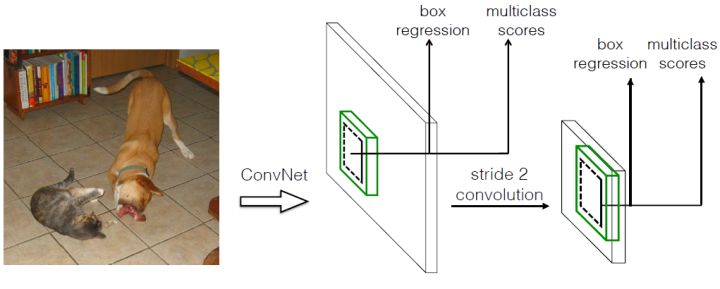

SSD（Single Shot MultiBox Detector） 理解

ssd是one-stage的目标检测算法，通过对特征图密集采样得到检测结果。相比于同样是one-stage的YoloV1算法，速度和准确率都有提升。它主要有两个改变：

- 移除全连接层，直接通过CNN进行检测：对大特征图卷积检测小物体，对小特征图卷积检测大物体。
- 采用不同尺度、不同高宽比的先验框（Prior boxes, Defaults boxes, Faster-RCNN中叫anchor）

